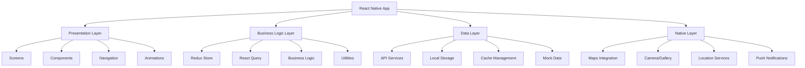

# Design Document

## Overview

本设计文档详细描述了基于React Native的家庭装修接单App前端架构设计。该应用采用现代化的React Native技术栈，严格遵循iOS Human Interface Guidelines设计规范，实现双端服务平台的完整功能。设计重点关注可扩展性、性能优化、用户体验和代码可维护性。

## Architecture

### 整体架构



### 技术栈选择

#### 核心框架
- **React Native 0.73+**: 跨平台移动应用开发框架
- **TypeScript**: 类型安全的JavaScript超集
- **Metro**: React Native默认打包工具

#### 状态管理
- **Redux Toolkit**: 现代化的Redux状态管理
- **React Query (TanStack Query)**: 服务端状态管理和缓存
- **Redux Persist**: 状态持久化

#### 导航系统
- **React Navigation 6**: 声明式导航库
- **Bottom Tab Navigator**: 底部标签导航
- **Stack Navigator**: 页面栈导航
- **Modal Navigator**: 模态框导航

#### UI与样式
- **NativeWind**: Tailwind CSS for React Native
- **react-native-vector-icons**: 图标库（FontAwesome）
- **react-native-reanimated 3**: 高性能动画库
- **react-native-gesture-handler**: 手势处理

#### 地图与定位
- **react-native-maps**: 地图组件
- **Google Maps SDK**: 地图服务提供商
- **Google Places API**: 地址搜索和自动补全
- **@react-native-community/geolocation**: 定位服务

#### 媒体处理
- **react-native-image-picker**: 相机和相册访问
- **react-native-fast-image**: 高性能图片组件
- **react-native-image-resizer**: 图片压缩和调整

#### 存储与网络
- **AsyncStorage**: 本地异步存储
- **Axios**: HTTP客户端
- **react-native-keychain**: 安全存储敏感信息

### 项目结构

```
src/
├── components/           # 可复用组件
│   ├── common/          # 通用组件
│   ├── forms/           # 表单组件
│   ├── maps/            # 地图相关组件
│   └── ui/              # UI基础组件
├── screens/             # 页面组件
│   ├── auth/            # 认证相关页面
│   ├── user/            # 用户端页面
│   └── worker/          # 装修工端页面
├── navigation/          # 导航配置
├── store/               # Redux状态管理
│   ├── slices/          # Redux Toolkit切片
│   └── api/             # RTK Query API定义
├── services/            # 业务服务
│   ├── api/             # API服务
│   ├── location/        # 定位服务
│   └── storage/         # 存储服务
├── hooks/               # 自定义Hooks
├── utils/               # 工具函数
├── constants/           # 常量定义
├── types/               # TypeScript类型定义
├── assets/              # 静态资源
│   ├── images/          # 图片资源
│   ├── icons/           # 图标资源
│   └── fonts/           # 字体资源
└── styles/              # 样式定义
    ├── colors.ts        # 颜色系统
    ├── typography.ts    # 字体系统
    └── spacing.ts       # 间距系统
```

## Components and Interfaces

### 核心组件设计

#### 1. 认证系统组件

```typescript
// AuthEntryScreen.tsx
interface AuthEntryScreenProps {
  onPhoneAuth: () => void;
  onSocialAuth: (provider: 'apple' | 'google' | 'facebook') => void;
}

// PhoneAuthScreen.tsx
interface PhoneAuthScreenProps {
  onSubmit: (phone: string, countryCode: string) => void;
  loading: boolean;
  error?: string;
}

// SMSVerificationScreen.tsx
interface SMSVerificationScreenProps {
  phone: string;
  onVerify: (code: string) => void;
  onResend: () => void;
  countdown: number;
  loading: boolean;
}

// UserTypeSelectionScreen.tsx
interface UserTypeSelectionScreenProps {
  onSelect: (type: 'customer' | 'worker') => void;
  loading: boolean;
}
```

#### 2. 地图相关组件

```typescript
// MapView.tsx
interface MapViewProps {
  initialRegion?: Region;
  markers?: MarkerData[];
  onMapPress?: (coordinate: LatLng) => void;
  onMarkerPress?: (marker: MarkerData) => void;
  showsUserLocation?: boolean;
  followsUserLocation?: boolean;
}

// LocationSearchBar.tsx
interface LocationSearchBarProps {
  placeholder: string;
  onLocationSelect: (location: LocationData) => void;
  onCurrentLocation: () => void;
  loading?: boolean;
}

// OrderMarker.tsx
interface OrderMarkerProps {
  order: OrderData;
  onPress: (order: OrderData) => void;
  status: 'available' | 'taken';
}
```

#### 3. 表单组件

```typescript
// OrderCreationDrawer.tsx
interface OrderCreationDrawerProps {
  visible: boolean;
  selectedLocation?: LocationData;
  onSubmit: (orderData: CreateOrderData) => void;
  onClose: () => void;
  loading: boolean;
}

// RenovationTypeSelector.tsx
interface RenovationTypeSelectorProps {
  selectedTypes: RenovationType[];
  onSelectionChange: (types: RenovationType[]) => void;
  multiSelect?: boolean;
}

// BudgetSlider.tsx
interface BudgetSliderProps {
  value: number;
  onValueChange: (value: number) => void;
  ranges: BudgetRange[];
}

// PhotoUploader.tsx
interface PhotoUploaderProps {
  photos: string[];
  onPhotosChange: (photos: string[]) => void;
  maxPhotos: number;
  onCameraPress: () => void;
  onGalleryPress: () => void;
}
```

#### 4. 列表和卡片组件

```typescript
// WorkerCard.tsx
interface WorkerCardProps {
  worker: WorkerData;
  onPress: (worker: WorkerData) => void;
  onFavorite: (workerId: string) => void;
  onContact: (workerId: string) => void;
  isFavorited: boolean;
}

// OrderCard.tsx
interface OrderCardProps {
  order: OrderData;
  onPress: (order: OrderData) => void;
  onStatusUpdate?: (orderId: string, status: OrderStatus) => void;
  userType: 'customer' | 'worker';
}

// OrderDetailModal.tsx
interface OrderDetailModalProps {
  visible: boolean;
  order?: OrderData;
  onClose: () => void;
  onAccept?: (orderId: string) => void;
  onContact?: (customerId: string) => void;
  onNavigate?: (location: LocationData) => void;
}
```

### 状态管理接口

#### Redux Store结构

```typescript
interface RootState {
  auth: AuthState;
  user: UserState;
  orders: OrdersState;
  workers: WorkersState;
  location: LocationState;
  ui: UIState;
}

interface AuthState {
  isAuthenticated: boolean;
  user: UserData | null;
  token: string | null;
  loading: boolean;
  error: string | null;
}

interface OrdersState {
  userOrders: OrderData[];
  workerOrders: OrderData[];
  nearbyOrders: OrderData[];
  selectedOrder: OrderData | null;
  loading: boolean;
  error: string | null;
}

interface LocationState {
  currentLocation: LocationData | null;
  selectedLocation: LocationData | null;
  searchResults: LocationData[];
  loading: boolean;
  error: string | null;
}
```

#### API服务接口

```typescript
interface ApiService {
  // 认证相关
  sendSMSCode(phone: string): Promise<ApiResponse<void>>;
  verifySMSCode(phone: string, code: string): Promise<ApiResponse<AuthData>>;
  refreshToken(token: string): Promise<ApiResponse<AuthData>>;
  
  // 订单相关
  createOrder(orderData: CreateOrderData): Promise<ApiResponse<OrderData>>;
  getUserOrders(userId: string): Promise<ApiResponse<OrderData[]>>;
  getWorkerOrders(workerId: string): Promise<ApiResponse<OrderData[]>>;
  getNearbyOrders(location: LocationData, filters: OrderFilters): Promise<ApiResponse<OrderData[]>>;
  acceptOrder(orderId: string, workerId: string): Promise<ApiResponse<OrderData>>;
  updateOrderStatus(orderId: string, status: OrderStatus): Promise<ApiResponse<OrderData>>;
  
  // 用户相关
  getUserProfile(userId: string): Promise<ApiResponse<UserData>>;
  updateUserProfile(userId: string, data: UpdateUserData): Promise<ApiResponse<UserData>>;
  getNearbyWorkers(location: LocationData, filters: WorkerFilters): Promise<ApiResponse<WorkerData[]>>;
  
  // 文件上传
  uploadImage(file: ImageData): Promise<ApiResponse<string>>;
  uploadMultipleImages(files: ImageData[]): Promise<ApiResponse<string[]>>;
}
```

## Data Models

### 核心数据模型

#### 用户相关模型

```typescript
interface UserData {
  id: string;
  phone: string;
  countryCode: string;
  userType: 'customer' | 'worker';
  profile: UserProfile;
  createdAt: string;
  updatedAt: string;
}

interface UserProfile {
  name: string;
  avatar?: string;
  location?: LocationData;
  isVerified: boolean;
  // 装修工特有字段
  skills?: string[];
  experience?: number;
  rating?: number;
  completedOrders?: number;
  portfolio?: PortfolioItem[];
  // 用户特有字段
  favoriteWorkers?: string[];
}

interface PortfolioItem {
  id: string;
  title: string;
  description: string;
  images: string[];
  renovationType: RenovationType;
  completedAt: string;
}
```

#### 订单相关模型

```typescript
interface OrderData {
  id: string;
  customerId: string;
  workerId?: string;
  status: OrderStatus;
  renovationType: RenovationType;
  budget: BudgetRange;
  location: LocationData;
  description: string;
  photos: string[];
  requirements?: string[];
  customer: CustomerInfo;
  worker?: WorkerInfo;
  timeline?: OrderTimeline[];
  createdAt: string;
  updatedAt: string;
}

type OrderStatus = 
  | 'pending'      // 待接单
  | 'accepted'     // 已接单
  | 'in_progress'  // 施工中
  | 'completed'    // 已完成
  | 'cancelled';   // 已取消

type RenovationType = 
  | 'kitchen'      // 厨房
  | 'bathroom'     // 卫生间
  | 'living_room'  // 客厅
  | 'bedroom'      // 卧室
  | 'study'        // 书房
  | 'whole_house'; // 全屋

interface BudgetRange {
  min: number;
  max: number;
  label: string; // "1-5万", "5-10万", "10-20万", "20万+"
}

interface OrderTimeline {
  id: string;
  status: OrderStatus;
  description: string;
  images?: string[];
  timestamp: string;
}
```

#### 地理位置模型

```typescript
interface LocationData {
  latitude: number;
  longitude: number;
  address: string;
  city: string;
  district?: string;
  placeId?: string; // Google Places ID
}

interface Region {
  latitude: number;
  longitude: number;
  latitudeDelta: number;
  longitudeDelta: number;
}

interface MarkerData {
  id: string;
  coordinate: LatLng;
  title: string;
  description?: string;
  type: 'order' | 'worker' | 'user';
  data: any; // 关联的数据对象
}

interface LatLng {
  latitude: number;
  longitude: number;
}
```

#### 筛选和搜索模型

```typescript
interface OrderFilters {
  distance?: number; // 距离范围（公里）
  budgetRange?: BudgetRange;
  renovationTypes?: RenovationType[];
  status?: OrderStatus[];
}

interface WorkerFilters {
  distance?: number;
  rating?: number; // 最低评分
  experience?: number; // 最少经验年数
  skills?: string[];
  priceRange?: BudgetRange;
}

interface SearchParams {
  query: string;
  location?: LocationData;
  radius?: number;
  filters?: OrderFilters | WorkerFilters;
}
```

### Mock数据结构

```typescript
// Mock用户数据
const mockUsers: UserData[] = [
  {
    id: 'user_001',
    phone: '13800138001',
    countryCode: '+86',
    userType: 'customer',
    profile: {
      name: '张女士',
      avatar: 'https://example.com/avatar1.jpg',
      location: {
        latitude: 39.9042,
        longitude: 116.4074,
        address: '北京市朝阳区望京SOHO',
        city: '北京市'
      },
      isVerified: true,
      favoriteWorkers: ['worker_001', 'worker_002']
    },
    createdAt: '2024-01-15T10:30:00Z',
    updatedAt: '2024-01-15T10:30:00Z'
  }
];

// Mock订单数据
const mockOrders: OrderData[] = [
  {
    id: 'order_001',
    customerId: 'user_001',
    status: 'pending',
    renovationType: 'kitchen',
    budget: { min: 50000, max: 100000, label: '5-10万' },
    location: {
      latitude: 39.9042,
      longitude: 116.4074,
      address: '北京市朝阳区望京SOHO',
      city: '北京市'
    },
    description: '需要重新装修厨房，包括橱柜、台面、瓷砖等，希望现代简约风格',
    photos: [
      'https://example.com/kitchen1.jpg',
      'https://example.com/kitchen2.jpg'
    ],
    customer: {
      id: 'user_001',
      name: '张女士',
      phone: '138****1234',
      avatar: 'https://example.com/avatar1.jpg'
    },
    createdAt: '2024-01-15T10:30:00Z',
    updatedAt: '2024-01-15T10:30:00Z'
  }
];
```

## Error Handling

### 错误处理策略

#### 1. 全局错误边界

```typescript
interface ErrorBoundaryState {
  hasError: boolean;
  error?: Error;
  errorInfo?: ErrorInfo;
}

class GlobalErrorBoundary extends Component<PropsWithChildren, ErrorBoundaryState> {
  constructor(props: PropsWithChildren) {
    super(props);
    this.state = { hasError: false };
  }

  static getDerivedStateFromError(error: Error): ErrorBoundaryState {
    return { hasError: true, error };
  }

  componentDidCatch(error: Error, errorInfo: ErrorInfo) {
    // 记录错误日志
    console.error('Global Error Boundary caught an error:', error, errorInfo);
    
    // 发送错误报告到监控服务
    // crashlytics().recordError(error);
  }

  render() {
    if (this.state.hasError) {
      return <ErrorFallbackScreen onRetry={() => this.setState({ hasError: false })} />;
    }

    return this.props.children;
  }
}
```

#### 2. API错误处理

```typescript
interface ApiError {
  code: string;
  message: string;
  details?: any;
}

interface ApiResponse<T> {
  success: boolean;
  data?: T;
  error?: ApiError;
}

class ApiErrorHandler {
  static handle(error: any): ApiError {
    if (error.response) {
      // 服务器响应错误
      const { status, data } = error.response;
      return {
        code: `HTTP_${status}`,
        message: data.message || '服务器错误',
        details: data
      };
    } else if (error.request) {
      // 网络错误
      return {
        code: 'NETWORK_ERROR',
        message: '网络连接失败，请检查网络设置',
        details: error.request
      };
    } else {
      // 其他错误
      return {
        code: 'UNKNOWN_ERROR',
        message: error.message || '未知错误',
        details: error
      };
    }
  }

  static isRetryable(error: ApiError): boolean {
    const retryableCodes = ['NETWORK_ERROR', 'HTTP_500', 'HTTP_502', 'HTTP_503', 'HTTP_504'];
    return retryableCodes.includes(error.code);
  }
}
```

#### 3. 地图错误处理

```typescript
interface MapErrorHandler {
  handleLocationError(error: GeolocationError): void;
  handleMapLoadError(error: Error): void;
  handlePlacesApiError(error: Error): void;
}

class MapErrorHandlerImpl implements MapErrorHandler {
  handleLocationError(error: GeolocationError) {
    switch (error.code) {
      case error.PERMISSION_DENIED:
        showAlert('定位权限被拒绝', '请在设置中开启定位权限');
        break;
      case error.POSITION_UNAVAILABLE:
        showAlert('定位信息不可用', '请检查GPS设置或移动到信号较好的地方');
        break;
      case error.TIMEOUT:
        showAlert('定位超时', '定位请求超时，请重试');
        break;
      default:
        showAlert('定位失败', '获取位置信息失败，请重试');
        break;
    }
  }

  handleMapLoadError(error: Error) {
    console.error('Map load error:', error);
    // 切换到备用地图模式或列表模式
    store.dispatch(setMapFallbackMode(true));
  }

  handlePlacesApiError(error: Error) {
    console.error('Places API error:', error);
    // 禁用地址搜索功能，提示用户手动输入
    showToast('地址搜索暂时不可用，请手动输入地址');
  }
}
```

### 用户友好的错误提示

```typescript
interface ErrorMessage {
  title: string;
  message: string;
  action?: {
    label: string;
    onPress: () => void;
  };
}

const ErrorMessages: Record<string, ErrorMessage> = {
  NETWORK_ERROR: {
    title: '网络连接失败',
    message: '请检查网络设置后重试',
    action: {
      label: '重试',
      onPress: () => {/* 重试逻辑 */}
    }
  },
  LOCATION_PERMISSION_DENIED: {
    title: '需要定位权限',
    message: '为了提供更好的服务，请开启定位权限',
    action: {
      label: '去设置',
      onPress: () => Linking.openSettings()
    }
  },
  MAP_LOAD_FAILED: {
    title: '地图加载失败',
    message: '已切换到列表模式，功能不受影响',
    action: {
      label: '重新加载',
      onPress: () => {/* 重新加载地图 */}
    }
  }
};
```

## Testing Strategy

### 测试架构

#### 1. 单元测试

```typescript
// 使用Jest和React Native Testing Library
import { render, fireEvent, waitFor } from '@testing-library/react-native';
import { Provider } from 'react-redux';
import { store } from '../store';

// 组件测试示例
describe('PhoneAuthScreen', () => {
  const renderWithProvider = (component: React.ReactElement) => {
    return render(
      <Provider store={store}>
        {component}
      </Provider>
    );
  };

  it('should validate phone number format', async () => {
    const mockOnSubmit = jest.fn();
    const { getByTestId } = renderWithProvider(
      <PhoneAuthScreen onSubmit={mockOnSubmit} loading={false} />
    );

    const phoneInput = getByTestId('phone-input');
    fireEvent.changeText(phoneInput, '138001380');

    const submitButton = getByTestId('submit-button');
    fireEvent.press(submitButton);

    await waitFor(() => {
      expect(mockOnSubmit).not.toHaveBeenCalled();
    });
  });

  it('should submit valid phone number', async () => {
    const mockOnSubmit = jest.fn();
    const { getByTestId } = renderWithProvider(
      <PhoneAuthScreen onSubmit={mockOnSubmit} loading={false} />
    );

    const phoneInput = getByTestId('phone-input');
    fireEvent.changeText(phoneInput, '13800138001');

    const submitButton = getByTestId('submit-button');
    fireEvent.press(submitButton);

    await waitFor(() => {
      expect(mockOnSubmit).toHaveBeenCalledWith('13800138001', '+86');
    });
  });
});
```

#### 2. 集成测试

```typescript
// API集成测试
describe('OrderService', () => {
  beforeEach(() => {
    // 设置mock API响应
    mockAxios.reset();
  });

  it('should create order successfully', async () => {
    const mockOrderData = {
      renovationType: 'kitchen',
      budget: { min: 50000, max: 100000, label: '5-10万' },
      location: { latitude: 39.9042, longitude: 116.4074, address: '测试地址' },
      description: '测试描述'
    };

    mockAxios.onPost('/api/orders').reply(200, {
      success: true,
      data: { id: 'order_001', ...mockOrderData }
    });

    const result = await OrderService.createOrder(mockOrderData);
    
    expect(result.success).toBe(true);
    expect(result.data?.id).toBe('order_001');
  });

  it('should handle network error', async () => {
    mockAxios.onPost('/api/orders').networkError();

    const result = await OrderService.createOrder({} as any);
    
    expect(result.success).toBe(false);
    expect(result.error?.code).toBe('NETWORK_ERROR');
  });
});
```

#### 3. E2E测试

```typescript
// 使用Detox进行E2E测试
describe('User Journey', () => {
  beforeAll(async () => {
    await device.launchApp();
  });

  beforeEach(async () => {
    await device.reloadReactNative();
  });

  it('should complete phone authentication flow', async () => {
    // 点击手机号登录
    await element(by.id('phone-auth-button')).tap();
    
    // 输入手机号
    await element(by.id('phone-input')).typeText('13800138001');
    await element(by.id('submit-button')).tap();
    
    // 输入验证码
    await element(by.id('sms-code-input')).typeText('123456');
    
    // 选择用户类型
    await element(by.id('customer-type-button')).tap();
    await element(by.id('confirm-button')).tap();
    
    // 验证跳转到主页
    await expect(element(by.id('user-home-screen'))).toBeVisible();
  });

  it('should create order successfully', async () => {
    // 假设已登录
    await element(by.id('map-view')).tap({ x: 200, y: 300 });
    await element(by.id('publish-button')).tap();
    
    // 填写订单信息
    await element(by.id('kitchen-type')).tap();
    await element(by.id('budget-slider')).swipe('right', 'fast', 0.5);
    await element(by.id('description-input')).typeText('测试装修需求');
    
    // 提交订单
    await element(by.id('submit-order-button')).tap();
    
    // 验证成功提示
    await expect(element(by.text('需求发布成功！'))).toBeVisible();
  });
});
```

### 性能测试

```typescript
// 性能监控
interface PerformanceMetrics {
  appStartTime: number;
  screenRenderTime: number;
  apiResponseTime: number;
  memoryUsage: number;
}

class PerformanceMonitor {
  static startTiming(label: string): void {
    console.time(label);
  }

  static endTiming(label: string): void {
    console.timeEnd(label);
  }

  static measureScreenRender(screenName: string): void {
    const startTime = Date.now();
    
    // 在屏幕渲染完成后测量
    requestAnimationFrame(() => {
      const renderTime = Date.now() - startTime;
      console.log(`${screenName} render time: ${renderTime}ms`);
      
      // 发送到分析服务
      // Analytics.track('screen_render_time', { screen: screenName, time: renderTime });
    });
  }

  static measureMemoryUsage(): void {
    if (__DEV__) {
      // 在开发模式下监控内存使用
      const memoryInfo = (performance as any).memory;
      if (memoryInfo) {
        console.log('Memory usage:', {
          used: Math.round(memoryInfo.usedJSHeapSize / 1048576) + ' MB',
          total: Math.round(memoryInfo.totalJSHeapSize / 1048576) + ' MB',
          limit: Math.round(memoryInfo.jsHeapSizeLimit / 1048576) + ' MB'
        });
      }
    }
  }
}
```

### 测试覆盖率目标

- **单元测试覆盖率**: ≥ 80%
- **组件测试覆盖率**: ≥ 90%
- **关键业务流程E2E测试**: 100%
- **API集成测试覆盖率**: ≥ 85%

### 持续集成测试流程

```yaml
# .github/workflows/test.yml
name: Test Suite

on: [push, pull_request]

jobs:
  test:
    runs-on: ubuntu-latest
    
    steps:
    - uses: actions/checkout@v3
    
    - name: Setup Node.js
      uses: actions/setup-node@v3
      with:
        node-version: '18'
        cache: 'npm'
    
    - name: Install dependencies
      run: npm ci
    
    - name: Run unit tests
      run: npm run test:unit
    
    - name: Run integration tests
      run: npm run test:integration
    
    - name: Generate coverage report
      run: npm run test:coverage
    
    - name: Upload coverage to Codecov
      uses: codecov/codecov-action@v3
```

这个设计文档提供了完整的技术架构、组件设计、数据模型、错误处理和测试策略。接下来我将询问用户是否满意这个设计，然后继续创建任务列表。